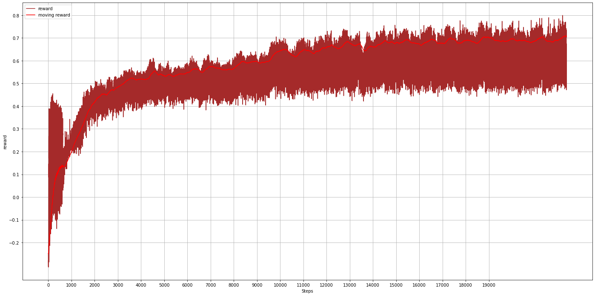
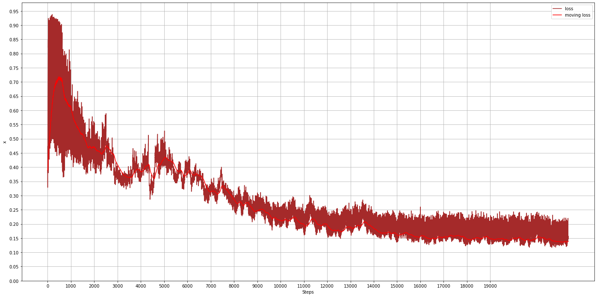
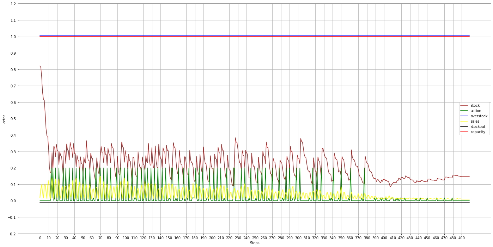

# Inventory Management with Reinforcement Learning

This project implements several research papers on supply chain management using reinforcement learning. The goal is to optimize inventory control while considering lead times, stock levels, and replenishment strategies.

## References

1. **Scalable Multi-Product Inventory Control with Lead Time Constraints Using Reinforcement Learning**  
   [Springer Link](https://link.springer.com/article/10.1007/s00521-021-06129-w)

2. **Using Reinforcement Learning for a Large Variable-Dimensional Inventory Management Problem**  
   [Conference Website](https://ala2020.vub.ac.be/)  
   [Paper PDF](https://ala2020.vub.ac.be/papers/ALA2020_paper_5.pdf)

3. **Reinforcement Learning for Multi-Product Multi-Node Inventory Management in Supply Chains**  
   [Arxiv Link](https://arxiv.org/abs/2006.04037)

## Project Overview

Supply chain optimization has multiple objectives, such as:
- Maintaining low inventory levels while preventing stockouts
- Reducing waste by minimizing excess inventory
- Balancing inventory across multiple products
- Managing inventory across both stores and warehouses with varying lead times
- (Potential future extension) Incorporating optimal pricing strategies

This project approaches inventory optimization as a reinforcement learning problem, specifically using an **actor-critic** framework. Implemented algorithms include:
- **A2C (Advantage Actor-Critic)**
- **A2C-mod** (a modified version as suggested in the referenced papers)
- **PPO (Proximal Policy Optimization)**

Currently, only **A2C and PPO** are functional. A baseline supply chain algorithm for performance comparison has not been implemented yet.

## Training Pipeline

### Step 1: Download the Instacart Dataset

The dataset used in this project is the **Instacart Online Grocery Shopping Dataset (2017)**. It can be accessed from:
- [Instacart Dataset](https://www.instacart.com/datasets/grocery-shopping-2017)
- [Kaggle Competition](https://www.kaggle.com/c/instacart-market-basket-analysis/data)

### Step 2: Prepare Training and Test Data

Run the following command to preprocess the data into TFRecords format:
```bash
python prepare_data.py
```

#### Data Preparation Notes:
- The dataset has an uneven distribution of shopping sequences.
- The start date for each customer's shopping sequence is randomly assigned but aligned with the day of the week.
- Subsequent shopping dates are computed based on observed inter-shopping durations.
- Training data follows a demand curve where purchase volume peaks and then declines over time.
- The dataset is filtered to include only grocery items.

### Step 3: Training

Train the reinforcement learning model using:
```bash
python training.py --action=TRAIN --output_dir checkpoints
```
Key points to monitor during training:
- Convergence of the actor and critic networks
- Reward stabilization
- Replenishment levels aligning closely with sales (e.g., sales of 0.1 should match replenishment of 0.1)

#### Inventory Control Considerations:
- The **waste parameter** controls downward pressure on inventory levels. Currently set to **0.20**, which stabilizes inventory at **~15%**.

Example reward curve:


Inventory tracking example:


### Step 4: Evaluation

Evaluation has not been fully implemented yet. However, key evaluation metrics should include:
- No excessive stockouts or overstocks
- Inventory levels minimized while maintaining demand fulfillment

Sample inventory and replenishment dynamics:


### Step 5: Prediction

To generate predictions, run:
```bash
time python training.py --action=PREDICT --output_dir checkpoints
```
This will generate an `output.csv` file containing key inventory metrics for each timestep. Tracking a single product over time should exhibit stable replenishment patterns similar to this:


## Future Work
- Implement baseline supply chain algorithms for benchmarking
- Evaluate model performance with additional metrics
- Explore reinforcement learning for dynamic pricing optimization
- Extend the model to handle multi-node supply chains with varied lead times

---
This project serves as an initial proof-of-concept for reinforcement learning-based inventory management, with future improvements planned to enhance its robustness and applicability.

